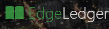

# EdgeLedger Website



Welcome to the EdgeLedger repository! This repository hosts the source code for the EdgeLedger website, a promotional site for a financial assistance services company.

## Deployment

The website is deployed and accessible at [https://omri-edgeledger.netlify.app/](https://omri-edgeledger.netlify.app/).

## Description

EdgeLedger is a fictional company that provides financial assistance services. This website serves as a showcase for the company's offerings and aims to create a positive online presence.

## Technologies Used

The following technologies were used in the development of this website:

- HTML
- CSS

## Getting Started

If you'd like to explore or contribute to the project, feel free to clone the repository and follow the steps below:

 Clone the repository:
   ```bash
   git clone https://github.com/your-username/EdgeLedger.git
   ````

## Screenshots


